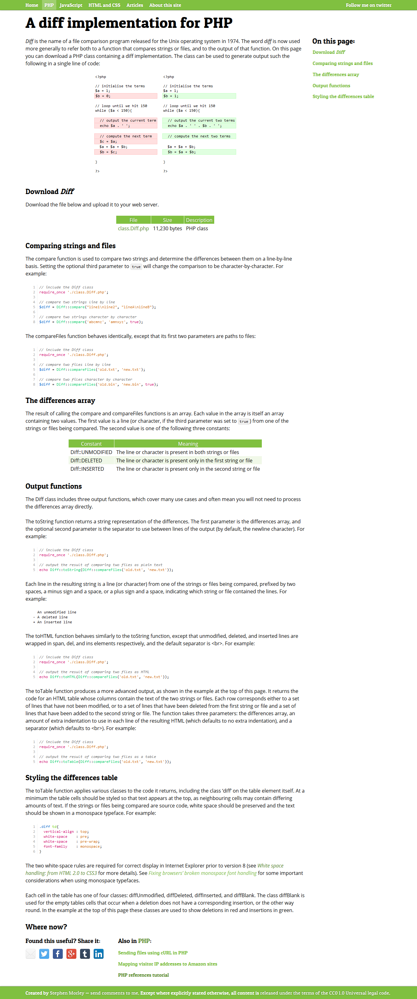

#PHP Diff Class

Sorry por el desastre en los comentarios pero es un borrador, poco a poco iré mejorando la documentación.

**Autor:** Stephen Morley 

**Fuente Original:** http://code.stephenmorley.org/php/diff-implementation/

**Extended by:** Carlos Maldonado @choquo

**Licencia:** Creative Commons, si lo usas tienes que dar crédito al autor, y a los colaboradores que ayudan a mejorar la clase.

###Diferencia de archivos por lineas o caracteres.

Compara dos archivos y encuentra partes modificadas, usa toMerge para mostrar el archivo actualizado quitando solo las lineas que se eliminaron y respetando las que no se modificaron junto con las nuevas lineas.

#Lo que se añadió
	
###Diff::toMerge
Genera un archivo actualizado
	
	$new_file = trim( Diff::toMerge(Diff::compareFiles('old.php', 'new.php')) );
	//Guardar $new_file, es el archivo que contine el merge entre old y new, osea el actualizado.

###Diff::haveChanges
Compara dos archivos para saber si hay cambios

	if( Diff::haveChanges(Diff::compareFiles('old.php', 'new.php')) ){ echo 'Es diferente'; }
	
### function compareToCleanOutput()
### function compareFilesToCleanOutput()

#Anotaciones generales

	<?php 
	//Updater
	require 'classes/DiffClass.php'; 
	
	//Get installed version
	$installed_version = file_get_contents('_installed_version.txt');
	echo '<strong>Version instalada:</strong>'.$installed_version.' ';
	echo '
';
	
	//Set source of updates
	$remote_url_update = 'http://localhost/updater/admin/_THESERVER/release/release-info.php';
	
	//Get remote version with file_get_contents (need allow_url_fopen enabled in server) - http://stackoverflow.com/a/15617547
	//$json_check_remote = file_get_contents( $remote_url_update );
	//$remote = json_decode($json_check_remote);
	
	//Get remote version using CURL - http://stackoverflow.com/a/15617547
	$ch = curl_init();
	curl_setopt($ch, CURLOPT_SSL_VERIFYPEER, false);
	curl_setopt($ch, CURLOPT_RETURNTRANSFER, true);
	curl_setopt($ch, CURLOPT_URL, $remote_url_update );
	$json_check_remote = curl_exec($ch);
	curl_close($ch);
	$remote = json_decode($json_check_remote);
	
	//Compare versions
	if( version_compare( $installed_version, $remote->version ) >= 0  ){
		$update_exist = false;
		echo '<h3>No existen actualizaciones disponibles</h3> ';
	}else{
	$update_exist = true;
	echo '<h3 style="color: #1FBD1B">Existen actualizaciones disponibles</h3>
		  
Aunque no suele ser necesario, se recomienda hacer un respaldo de la informacion antes de actualizar.

		  <a href="">Descargar respaldo</a> | <a href="?action=do_update">Actualizar ahora</a>  ';
	echo '<h4>Detalles de la actualizacion:</h4>';
	echo '<strong>Version disponible:</strong> '.$remote->version.' ';
	echo '<strong>Package:</strong> '.$remote->package.' ';
	echo '<strong>Liberado:</strong> '.$remote->dateRelease.' ';
	echo '<strong>Comentarios:</strong>   '.$remote->comments.' ';
	
	}

	//Check if files have changes
	//====================================
	echo '
';
	if( Diff::hasChanged(Diff::compareFiles('old.php', 'new.php')) ){
		echo 'Es diferente ';
	}else{
		echo 'Es igual ';
	}
	echo '
';

	//Read installed files
	$directory = '.';
	$scanned_directory = array_diff(scandir($directory), array('..', '.'));
	if(is_array($scanned_directory)){
		foreach ($scanned_directory as $file) {
			if( is_dir($file) )
			{
				echo ' - [Soy una carpeta] '.$file.' ';
			}else
			{
				echo $file.' ';
			}
		}
	}

	
	//Escribir el archivo actualizado en un nuevo archivo o reemplazarlo.
	//============================================================================
	$fp = fopen($updated_file, 'w');
	$new_file = trim( Diff::toMerge(Diff::compareFiles('old.php', 'new.php')) );
	fwrite($fp, $new_file );

